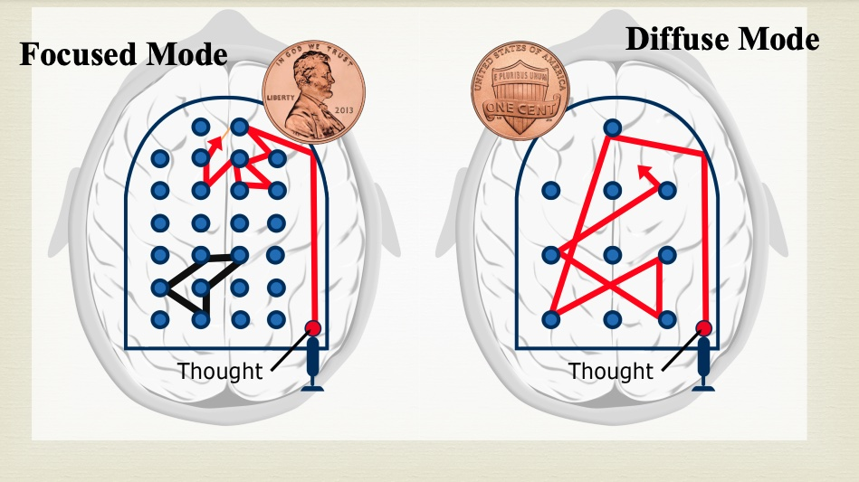

# Learning How to Learn: Powerful mental tools to help you master tough subjects

This repository contains my personal notes on the Coursera course "Learning How to Learn", by Barbara Oakley.

[Learning How to Learn: Powerful mental tools to help you master tough subjects](https://www.coursera.org/learn/learning-how-to-learn)

The course presents methods for learning based on the latest neuroscience research insights.

Overview:
1. Focused versus Diffuse Thinking

Mikel Sagardia, 2021.
No warranties

## 1. Focused versus Diffuse Thinking

Two modes of thinking ar distinguised:
- Focused thinking: it is related to solving problems we know or whic are similar to scenarios we are familiar with
- Diffuse thinking: related to solving problems we are not familiar with

Focused and Diffuse Modes: Analogy with pinball (c) Kevin Mendez.

Some notes:
- If we are in one mode, we cannot benefit from the other
- In focused mode, we directly access our brain part related to the solving
- In the diffuse mode, we more slowly need to explore pathways and need more space between neural networks/pathways
- Analogies and metaphores provide powerful techniques for learning.
- We should learn a little bit every day and relax for maximum effectiveness.
- Similarly, it is helpful to wander/alternate from focused to diffuse modes and back. Dali and Edison used to leverage that: Dali used to sit on a chair with a key in his hand and wait to falling asleep; in that moment, the key used to drop and he used to wake up, so he would focus on the thoughts that appeared in a diffuse sleepy mode.
- **Advise: if we are stuck trying to solve/understand something, activate the difuse mode (go for a walk, have a shower, sleep, etc.); the probability of succeeding increases!**

### 1.1 What Is Learning?

Most complex functions are unconscious: vision, hearing, understanding.

Our brain has one **million billion** synapses, each of about 10 microns. They appear and disappear constantly, for instance after **learning and/or sleeping**. A not well undertood question in this regard is *how is the memory preserved?*.

Another interesting research topic is the [Default Mode Network (DMN)](https://en.wikipedia.org/wiki/Default_mode_network): this large network activates when a person is awake but not fosuces on the outside world, such as ini a state of daydreaming.

Interesting website: [BrainFacts](https://www.brainfacts.org/)

## 2. Procrastination, Memory, and Sleep

We procrastinate because our brain wants to spare us from unpleasant experiences: we see something we don't like and our attention goes to something we are better at, which causes us to be happier.

The pomodoro technique works agains procrastination: 25 minutues of focus followed by a reward during 5 minutes.

Math and science topics are the most abstract ones, that's the reason they're often the most difficult to learn.

Repeating a type or class of problems during time, with relaxation periods in between is the best way to master a topic.
Our brain goes from focus mode to difuse mode; during difuse mode, experiences are organized, neural patterns are strengthended.

### We have two main types of memories

- Working memory: small and bad memory used during current activities; it is bad because we cannot store many information for long periods, since it dissipates. That's why we need to repeat telephone numbers until we write them down. It is believed that it consists of 4 chunks of information; like 4 slots where we can put stuff but they fall easily. It is located manily in the prefontal cortex, although it is connected to the rest of the brain
- Long-term memory: very large storage of information. It is not as fast, but it is immense. It is so large that we sometimes cannot find information stored in it. The more we repeat the patterns in it (ie., recall things), the better they are stored and accessible.

The best way to store information in the long-term memory is to separate the learning in the time: several times a week.
The more times we access some information from the long-term memory, the better that information remains fixed.

### Sleep is fundamental for learning

- It is not a waste of time, because during sleep the toxins in our brain generated in our awake hours are eliminated
- During sleep unimportant neaural patterns are erased and the important ones strengthened
- If we practice something before sleep, chances of dreaming with it are higher, which helps solving any related difficult problems

### Interview with Dr. Terrence Sejnowski

- Active learning (doing) is much more powerful than passive one
- If your're in a boring lecture, make questions!
- Go jogging or do unrelated activities to enter and leverage the difuse mode; often the problem is remembering those thoughts
- Multi-tasking is context switching very fast; some people are better than other doing that
- Neurogenesis happens in the adulthood, in the hippocampus; the most important factors for the neurogenesis are
    - A rich and stimulating environment
    - Physical exercise: that is crucial for education!
- Surrounding yourself with creative people boosts creativity
- Try to look at things with different eyes to learn new stuff!

### Tips from neuroscience to keep you focused on hard tasks, David Badre, Nature 2021

- Set long time blocks for serious and hard work, even if we're not productive, because the brain needs time to switch the context and access all necessary information
- Be consistent, even if we're not successful all the time: work everyday on the hard task, bacause consistency aids memory
- Multitasking is bad, because all tasks use the same working memory, so we underperform
- Remove distraction! Hide your phone
- Beware of the easy tasks: we often avoid hard tasks in favour of smaller ones
- Try to approach hard-problem-solving in a structured way; if we see our plan doesn't work, we open to change it
- Take breaks! Incubation of ideas happens during breaks.
- Interact with others: informal spontaneous chats with people of different backgrounds motivate and help acquiring new perspectives
- **Never write and edit at the same time! Writing shoukd happen in a state close to the difuse mode; editting should happen in a state close to the focussed mode.**

## 3. Chunking

Chunks are pieces of information that bind together to form a mental object that has a meaning; somehow, meaning is fundamental to bind bits of information to create something useful. In practice, chunks are sets or small networks of neurons that fire together; these networks can expand as we acquire more knowledge and experience. That is very practical, because, as I understand, while a chunk can become quite complex, we can still access it easily; for example, in the morning I dress up: that's a complex chunk which we understand, but that is decomposed in many complex activities: select clothes depending on weather and where we're going, movements to dress up, etc.

The working memory has space for just 4 chunks: we can access four chunkcs from our brain. That happens usually in focused mode. What happens in difuse mode is very different: many random connections activate in our brain.

When we're stressed, afraid, angry, etc., we cannot access and work properly even with those 4 chunks.

### 3.1 How to form a chunk

First, it is useful to observe a useful pattern of what we want to achieve. Then, we break down that functionality into pieces and try and repeat those pieces independently. Thus, the complete chunk is broken down into smaller chunks; when the smaller ones have been processed, we can join them into a bigger chunk.

Chunking works differently for each discipline, but we have some abstract steps that are the same for all cases:
1. Focus your attention on the material: focused mode; remove all distractions
2. Understand the main idea of the concept, the gist; alternation between focused and difuse modes is very helpful here.
    - Note that we can form chunks of things we don't understand, but these won't be useful in the future, because we're not going to be able to use or relate them to other concepts
    - Understanding a concept is not sufficient to form a chunk! If we do not use and repeat it, it will fade.
    - Understanding is like a glue that binds pieces together
    - Metaphore and analogy help learning
3. Create the context: understand when the chunk can be used and when not; context is where the bottom-up and top-down learning meet, and it's fundamental to aware of them in the whole learning process
    - bottom-up learning: learning the smallest chunks, the basic techniques; it is recommended to try the examples while learning
    - top-down learning: understanding the big picture; it is recommended to have a look at the overview of a text book before starting to learn
    - context: deciding which chunks to use when and which not
4. Practice or repetition is essential to fix the chunk and broaden the network of neurons related to it; in that way, that chunk will be accessible from many different paths

### 3.2 Illusions of Competence

When learning, the process of **recalling** works better than re-reading some text.
Recalling means we need to reproduce what we learned without observing it. In practice, concepts start condensing into bigger chunks when we retrieve information, so we're able to hold more information in our working memory (remember, we have space to only 4 chunks in our memory) -- big consolidated chunks are represented as a hyperlink in the small working memory, and teh rest of the working memory is left clear!

Mind maps make sense only when smaller chunks have been fixed. Re-reading makes sense only if you let time between reads.

The **illusion of competence** happens, for instance, when we understand a solution and think we would have done that the same way; it is a mere illusion! We really need to repeat and re-train to create the chunk.

Similarly, underlining is dangerous, because we can highlight misleading parts and think we're making a productive effort. The best strategy for underlining is the following
- Read first to have an idea
- Underline the key sentence in a paragraph
- Make notes on the margins

The best way to fight the illusion of competence is testing: mistakes are very valueble to update our thinking and understanding of chunks.

It is helpful to recall outside of our room of study, too. Sometimes we take subliminal cues of the room when learning; in the exam or when using the stuff we learned, in the absence of those cues we might get blocked or have problems to access the chunks correctly.

## 4. Seeing the Bigger Picture

### 4.1 Neuromodulators

Neuromodulators do not carry so much the content of what is being perceived or learned, but their **importance and future value**. While neurotransmitters are released by neurons to send signals between them, neuromodulators affect the effectiveness of those signals.

Three important neuromodulators involved in learning:

**Acetylcholine**
- It is active while focused learning, when we're paying close attention.
- Involved in long-term memory, since it affects neuro-plasticity.

**Dopamine**
- Related to motivation, reward learning
- It signals in relation to unexpected rewards
- It affects decision making
- Future reward policies are affected with it
- Addictive drugs artificially alter dopamine pathways
- A loss of domapine leads to anhedonia: loss of interest; if very low, Parkinson's appears (tremors); and if minimum, catatonia (absence of movement).
- Pomodoro is great because those 5 minutes after the 25 minutes of focused learning affect our dopamine system for good!

**Serotonine**
- Related to our social live: alpha males have the highest levels of serotonine
- Prozac (for depression) raises srotonine activite
- Higher risks (more violence) are taken if we have lower levels of serotonine

Recent studies show that cognition is intertwined to emotion. Cognition and emotion are integrated in the amigdala, together with memory processing; so we want to keep our amigdala happy for better learning.

### 4.2 A Library of Chunks

Our goal should be to create as much compact and dense chunks as possible: chunks are a way of grouping complex information in our brain. The more we practice chunk, the stronger it is in the brain. Later, when we operate in a difuse mode, we access those chunks! Additionally, having many strong chunks makes possible to operate better in focused mode, since chunks are ready to be quickly used.

Also, it often happens that we can **transfer** the patterns in a chunk related to a discipline to a problem from another discipline.

We have to main ways for problem solving:
1. Sequential: it is related to focused mode, we take one step at a time
2. Holistic: it is related to the difuse mode, we wander among our chunks and let the intuition guide us; however, those solving methods need to be reviewed in a focused mode.

The **law of serendipity** says that *luck favors the one who tries*: if don't wnat/know where to start, just start with some unit we'd like, then things get easier.

### 4.3 Overlearning

Repeating is fundamental for learning: we strengthen the chunks we're creating. However, reapeating something we already know and seems easy to us is counterproductive: it creates the **illusion of competence**, when we just mastered th easy stuff. We should focus on the more difficult material: that is called **deliverate practice**.

Often times our first intuition to solving a problem when we're learning a discipline is erroneous: we need to unlearn it; that's the concept of **Einstellung**: the (erroneous/unexperienced) mindset. First, we need to learn and repeat and select chunks.

**Interleaving** is great for improving creativity and mastery in a field. It consists in jumping between problems of different chapters, so that the contrast of each environment makes more evident which approaches to use in each setting. We go beyond the world of repetition and start making connections.

Interleaving is also true for inter-disciplinary settings: if we can change between disciplines it is helpful and we can transfer concepts from one discipline to the other. If we focus only in one discipline, we're trapped with the Einstellung. That is why many scientific revolutions happen via (1) young people or (2) people from other disciplines -- that's because they're not trapped by the Einstellung.

## 5. Procrastination

Procrastination occurs because our brain anticipates a painful situation or effort; thus, our focus goes to pleasure activities.

Procrastinations shares similarities with addition: temporary excitement and relief. However, it can cause really bad future situations; similarly, solving the issue of procrastination can unfold many positive effects on our lifes.

Chunking is basically creating habits: the first time we do something it feels really difficult and we are focused and even overwhelmed by the amout of cues we are receiving; as we repeat and create the habit or chunk, it becomes much easier, since the skills are compressed and easily accessible, and we can free our mind for other information/tasks. Practicing a habit we become like zombies: we carry out the task without being really aware or conscious of it; for example: driving.

Habits are central in procrastrination; we can have good or bad habits, they can be brief in time or long, but all of them have the following properties

1. The cue: the signal that triggers a habit, good or bad; for example: text message - Monday 17:00
2. The routine: habitual response the seeing the cue, zombi mode: read and respond messages - work out
3. The reward: every habit continues because we get something positive from it, pleasure: get informed entertained - feel good, healthy
4. The belief: habits have power because we have strong underlying beliefs of them: I connect to friends - being healthy gives me life quality

